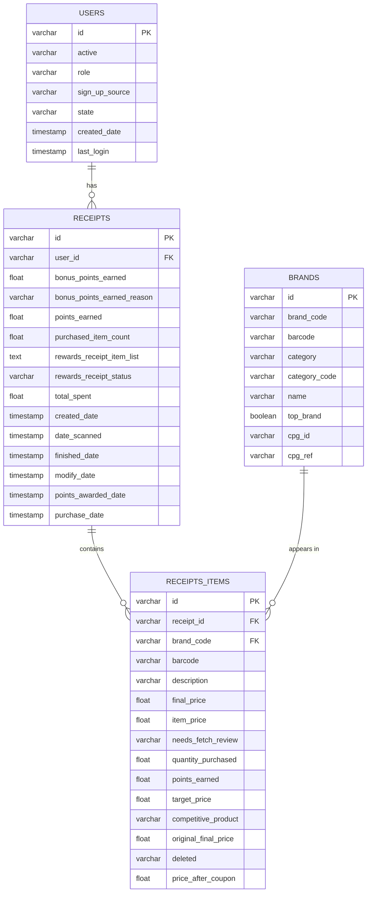

| receipts |
|:-------------:|
| id (PK) |
| user_id (FK)|
| bonus_points_earned |
| bonus_points_earned_reason |
| points_earned |
| purchased_item_count |
| rewards_receipt_item_list |
| rewards_receipt_status |
| total_spent |
| created_date |
| date_scanned |
| finished_date |
| modify_date |
| points_awarded_date |
| purchase_date |

| receipts_items |
|:-------------:|
| id (PK) |
| receipt_id  (FK)|
| barcode |
| description |
| final_price |
| item_price |
| needs_fetch_review |
| partner_item_id |
| prevent_target_gap_points |
| quantity_purchased |
| user_flagged_barcode |
| user_flagged_new_item |
| user_flagged_price |
| user_flagged_quantity |
| needs_fetch_review_reason |
| points_not_awarded_reason |
| points_payer_id |
| rewards_group |
| rewards_product_partner_id |
| user_flagged_description |
| original_meta_brite_barcode |
| original_meta_brite_description |
| brand_code  (FK)|
| competitor_rewards_group |
| discounted_item_price |
| original_receipt_item_text |
| item_number |
| original_meta_brite_quantity_purchased |
| points_earned |
| target_price |
| competitive_product |
| original_final_price |
| original_meta_brite_item_price |
| deleted |
| price_after_coupon |
| metabrite_campaign_id |

| users |
|:----:|
| id (PK) |
| active |
| role |
| sign_up_source |
| state |
| id |
| created_date |
| last_login |

| brands |
|:--------:|
| id (PK) |
| barcode |
| category |
| category_code |
| name |
| top_brand |
| brand_code |
| cpg_id |
| cpg_ref |